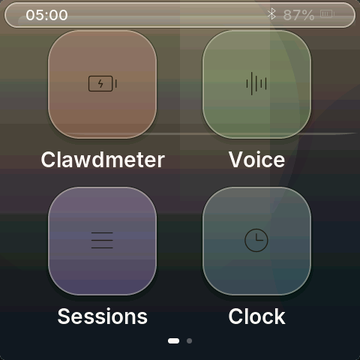
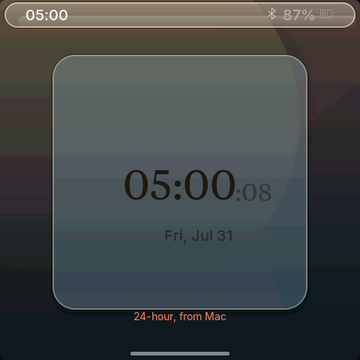
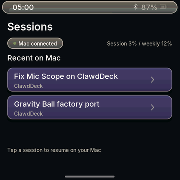
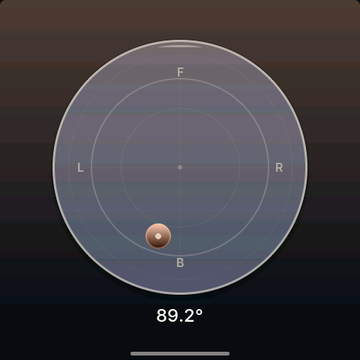
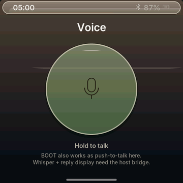
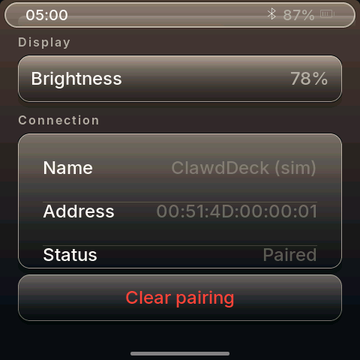
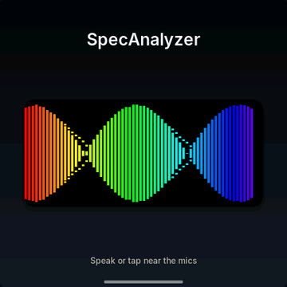
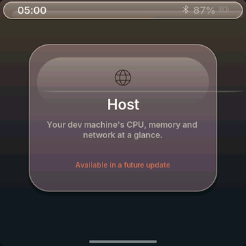
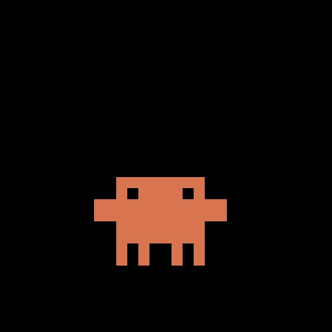
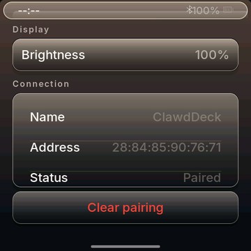

# ClawdDeck

A desk-side ESP32 command deck: a pocket dashboard that keeps an eye on
Claude Code usage — and runs a full Apple-grade app suite on its
480×480 square AMOLED.

ClawdDeck grew out of **Clawdmeter** — the Claude Code usage meter that is
still the heart of the deck (its meter app is the launcher's first tile).
ClawdDeck = Clawdmeter + the phone-style launcher it deserved.

|  Home (Liquid-Glass launcher)  |  On hardware  |
| :---: | :---: |
|  |  |

## The apps

480×480 square AMOLED, LVGL 9, 16bpp — no GPU, no blur, everything drawn.
Every screen went through the same gauntlet: build → verify against real
Apple reference imagery → independent blind critic → iterate until the
critic takes the candidate over the reference.

|  |  |  |  |
| :---: | :---: | :---: | :---: |
|  |  |  |  |
| **Clock** — glass watchface card, live seconds tier, 24h via the host | **Sessions** — recent Claude sessions, tap to resume on the Mac | **Level** — real IMU bubble dial (89.2° of desk tilt, live) | **Voice** — push-to-talk hero, glass mic button |
|  |  |  |  |
| **Settings** — brightness, BLE pairing, storage/memory/battery telemetry, close background apps, restart / power-off (two-tap guarded) | **SpecAnalyzer** — live spectrum | **Host** — placeholder in the glass-card language | **Clawdmeter** — the original usage meter + splash animations |

On hardware — settings with real BLE name/MAC + the pairing danger card on
the panel, next to the sim reference:

|  Settings (sim)  |  Settings (hardware)  |
| :---: | :---: |
|  |  |

### What's in Settings now

- **Display** — brightness (cycled live, NVS-backed).
- **Connection** — device name, MAC, bond status; **Clear pairing** as the
  destructive card (two-tap confirm).
- **Device** — **storage %** (of the sketch partition), **memory %** (heap,
  with PSRAM boards showing free RAM), **battery %** (live, charging aware).
- **Actions** — **Close background apps (n)** (torn down properly, count
  updates live), **Restart**, **Power off**. The two one-shot actions are
  guarded: first tap arms them ("Tap again to confirm", 4-second window) so
  a stray double-press can't reboot or brick the session.

## Screens

The device boots into the splash. Swiping horizontally pages the launcher;
tap a tile to open its app; swipe up (or the home pill) returns home.

While the splash is up, the middle (PWR) button cycles animations. **Hold
the power button for 3 seconds, then release, to put the device into
pairing mode** — this clears the saved Bluetooth bond and re-advertises.
The firmware also auto-rotates animations every 20 s within the current
usage-rate group.

## Hardware

Boards supported out of the box:

- [Waveshare ESP32-S3-Touch-AMOLED-2.16](https://www.waveshare.com/esp32-s3-touch-amoled-2.16.htm?&aff_id=149786)
- [Waveshare ESP32-C6-Touch-AMOLED-2.16](https://www.waveshare.com/esp32-c6-touch-amoled-2.16.htm?&aff_id=149786)
- [Waveshare ESP32-S3-Touch-AMOLED-1.8](https://www.waveshare.com/esp32-s3-touch-amoled-1.8.htm?&aff_id=149786)
- [Waveshare ESP32-C6-Touch-AMOLED-1.8](https://www.waveshare.com/esp32-c6-touch-amoled-1.8.htm?&aff_id=149786)
- [Waveshare ESP32-S3-Touch-AMOLED-2.06](https://www.waveshare.com/esp32-s3-touch-amoled-2.06.htm?&aff_id=149786)
- [Waveshare ESP32-S3-Touch-LCD-1.54](https://www.waveshare.com/esp32-s3-lcd-1.54.htm?sku=33869&aff_id=149786)
- [Waveshare ESP32-S3-Touch-LCD-4](https://www.waveshare.com/esp32-s3-touch-lcd-4.htm)

> Please check if a pull request exists for your alternative hardware port
> before opening a new one — QA feedback and testing on the same hardware is
> more valuable than duplicate pull requests.

**Porting to another board:** the firmware is a thin HAL with per-board
folders under `firmware/src/boards/`. Drop in a new folder and a new
PlatformIO env — `main.cpp`, `ui.cpp` and `splash.cpp` never need to change.
See [`docs/porting/adding-a-board.md`](docs/porting/adding-a-board.md) for
the walk-through and [`docs/porting/hal-contract.md`](docs/porting/hal-contract.md)
for the interfaces a port must implement.

## Credits

- **Clawdmeter** — ClawdDeck is a fork of
  [HermannBjorgvin/Clawdmeter](https://github.com/HermannBjorgvin/Clawdmeter)
  by Hermann Björgvin Haraldsson. The usage-meter concept, the BLE protocol,
  the daemon fleet, the board-port family and the splash-animation system
  all come from that project; Clawdmeter remains a first-class app inside
  ClawdDeck (the launcher's first tile). All the earlier commits in this
  repo's history are his work.
- Pixel-art Clawd animations are Anthropic's official mascot art
  (claude.ai/code, Claude Code desktop), archived and converted by the
  tooling in `tools/` and `research/clawd-official/`.
- The macOS host pieces were ported by
  [Chris Davidson (@lorddavidson)](https://github.com/lorddavidson).
- **Inter** and **Phosphor** fonts (SIL OFL / MIT) for the UI type stack;
  Lucide (MIT) for utility glyphs.
- Anthropic brand fonts (Tiempos Text, Styrene B) — see the licensing note.

## Licensing gray area warning

The software in this repository uses and adheres to the Anthropic brand
guidelines and uses the same proprietary fonts that Anthropic has a license
for but this software uses without permission, as well as using assets from
Anthropic such as the copyrighted Clawd mascot. Even though the code in
this repo is non-proprietary, I will not license it myself under a copyleft
license since this repo includes proprietary fonts and copyrighted assets.
Please be aware of this if you fork or copy code from this repo.
**You have been warned!